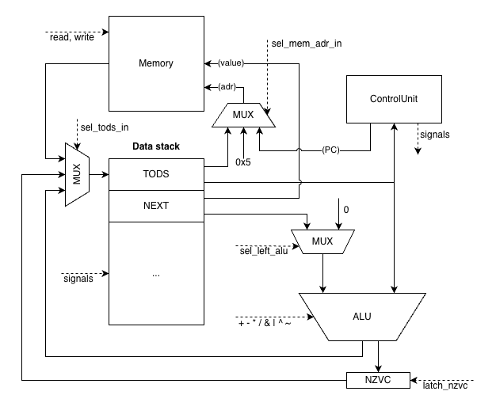
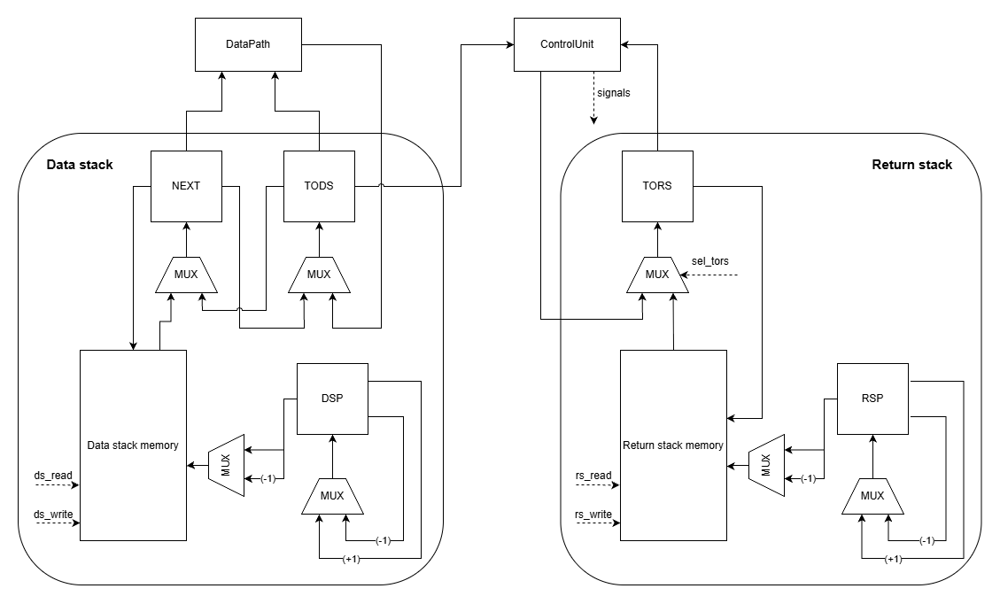
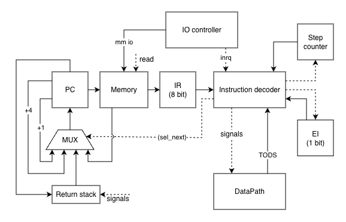

# Лабораторная работа №4

- Жеребцов Михаил Александрович, группа P3217, ису 465887
- `forth | stack | neum | hw | tick | binary | trap | mem | cstr | prob2 | cache`

## Оглавление

- [Язык программирования - Forth](#язык-программирования---forth)
  - [Описание синтаксиса](#описание-синтаксиса)
  - [Описание семантики](#описание-семантики)
  - [Переменные](#переменные)
  - [Типизация](#типизация)
  - [Области видимости](#области-видимости)

- [Организация памяти и стеков](#организация-памяти-и-стеков)
  - [Организация памяти](#организация-памяти)
  - [Организация стеков](#организация-стеков)

- [Система команд](#система-команд)
  - [Особенности процессора](#особенности-процессора)
  - [Цикл исполнения команды](#цикл-исполнения-команды)
  - [ISA](#isa)
  - [Бинарное представление](#бинарное-представление)
  - [Коды операций](#коды-операций)

- [Транслятор](#транслятор)
  - [Этапы работы транслятора](#этапы-работы-транслятора)
  - [Организация машинного кода после трансляции](#организация-машинного-кода-после-трансляции)

## Язык программирования - Forth

### Описание синтаксиса

``` ebnf
<program> ::= <terms>

<terms> ::= { <term> }

<term> ::= <number>
         | <operand>
         | <identifier>
         | <var_init>
         | <word_init>
         | <if-term>
         | <loop-term>
         | <import-term>
         | <comment>

<number> ::= <знаковое десятичное число>
<string> ::= s"<любая последовательность символов>"

<operand> ::= "+"
            | "-"
            | "/"
            | "*"
            | "&"
            | "|"
            | "^"
            | "~"
            | "dup"
            | "drop"
            | "swap"
            | "over"
            | "@"
            | "!"

<identifier> ::= <любая последовательность символов, кроме пробелов и "(", ")", "\">

<var_name> ::= <identifier>
<var_init> ::= "VAR" <number> <var_name>
             | "VAR" <string> <var_name>
             | "VAR" "ALLOC" <number> <var_name>

<word> ::= <identifier>
<word_init> ::= ":" <word> <terms> ";"

<if-term> ::= "IF" <terms> "THEN"
            | "IF" <terms> "ELSE" <terms> "THEN"

<loop-term> ::= "BEGIN" <terms> "WHILE" <terms> "REPEAT"

<import-term> ::= "INCLUDE" <string>

<comment> ::= "\" <любая последовательность символов до переноса строки>
            | "(" <любая последовательность символов> ")"
```

### Описание семантики

- Язык является стековым. Все операции выполняются над стеком данных. Литералы при выполнении помещаются на вершину стека, арифметические и логические операции берут операнды с вершины стека и помещают результат обратно.

- Код выполняется последовательно слева направо, за исключением вызова слов-процедур, условных переходов и циклов.

- Используется постфиксная запись (обратная польская нотация).
Например:
`
2 3 +
`
сначала помещает 2 и 3 на стек, затем операция + снимает два значения и кладёт результат 5.

- В языке используются процедуры, называемые словами. Слово -- это именованная последовательность операций, которая может быть выполнена при обращении по имени.
Слово объявляется с помощью конструкции:
`: NAME ... ;`
При объявлении слово добавляется в словарь языка и становится доступным для последующего использования.
Вызов слова осуществляется при указании в программе его названия, реализуется через механизм перехода с сохранением адреса возврата в стек возврата.

- Поведение слов может описываться с помощью стековой сигнатуры вида:
( входные_значения -- выходные_значения )
Например:
( a b -- c ) означает, что слово снимает два значения со стека и помещает один результат.

- Файлы можно импортировать друг в друга. Например: `INCLUDE s"math.fs"`. Импорт является inline вставкой текста из импортируемого файла во время компиляции.

- Условные конструкции используют значение на вершине стека как флаг: 0 считается ложью, любое ненулевое значение -- истиной. Перед переходом флаг снимается со стека.
Пример:

```
INCLUDE s"math.fs"      \ оператор > импортируется из math.fs
5 3 > IF 1 ELSE 0 THEN
```

- Цикл имеет форму:
`BEGIN условие WHILE тело REPEAT`
Код между BEGIN и WHILE должен оставить на стеке флаг. Если флаг равен 0, цикл завершается. Если флаг не равен 0, выполняется тело цикла, после чего управление возвращается к BEGIN.
Пример:

- Поддерживается вложенность управляющих конструкций (IF и WHILE).

```
INCLUDE s"math.fs"      \ оператор > импортируется из math.fs
INCLUDE s"io.fs"        \ слово WRITE импортируется из io.fs
BEGIN dup 0 > WHILE dup WRITE 1 - REPEAT
```

### Переменные

- Переменные в языке представляют собой именованные области памяти.
Объявление выполняется с помощью оператора `VAR`, который выделяет фиксированный участок памяти и связывает его адрес с именем переменной.
Память выделяется статически при компиляции.

- При выполнении имени переменной на стек помещается адрес соответствующей области памяти.
Доступ к значению переменной осуществляется через операции:
  - `@` — чтение значения по адресу;
  - `!` — запись значения по адресу.

- Строка представляется как непрерывный участок памяти, заканчивающийся символом `\0` (C-строка).

- Строковые переменные объявляются следующим образом:
  - `VAR s"..." NAME` -- создаёт переменную и инициализирует её строковым литералом;
  - `VAR ALLOC <размер> NAME` -- выделяет участок памяти заданного размера.

### Типизация

- Язык имеет слабую динамическую типизацию.

- Все значения представлены как машинные слова фиксированной разрядности.

- Тип значения не хранится явно и определяется только контекстом использования.

### Области видимости

- Имена переменных и слов хранятся в общем словаре языка.

- После объявления слово или переменная доступны во всём коде, который расположен после объявления.

- Если имя объявляется повторно, новая запись перекрывает старую.

- Локальных областей видимости нет.

## Организация памяти и стеков

### Организация памяти

- Программа и данные размещаются в общем адресном пространстве (архитектура фон Неймана).

- Общий размер памяти и стеков не ограничен.

- Размер ячейки памяти -- `8 бит`. Память адресуется побайтно.

- Размер машинного слова -- `32 бита`. Операции чтения и записи машинного слова используют 4 последовательных байта памяти, начиная с заданного адреса.

- Программист имеет доступ на чтение/запись в любую ячейку памяти.

- Поддерживается только абсолютная адресация.

- При обращении к имени переменной на стек данных помещается адрес соответствующей области памяти.

- Адрес `0x5` зарезервирован под вектор прерывания. Обработчик задаётся через специальное зарезервированное имя слова `interruption_handler`.

- Адреса `0x9` и `0xD` зарезервированы под устройства ввода-вывода, реализованные через memory-mapped I/O.

- Данные в памяти хранятся в формате `Big-endian` (старшая часть числа раньше в памяти)

- Используется стек данных и стек возврата, они являются отдельным физическим устройством по отношению к памяти данных и команд.

- Любые данные в памяти могут быть изменены во время выполнения. Любому числу отведено в памяти одно машинное слово, любому символу строки отведён 1 байт -> в одно машинное слово можно записать 4 символа. Адресация в байтах начинается с `0x0`.

```
             Memory
+------------------------------+
| 0x0  : jmp n                 |
|    ...                       |
| 0x5  : interruption vector   |
|    ...                       |
| 0x9  : io-controller in      |
|    ...                       |
| 0xD  : io-controller out     |
|    ...                       |
| v+0 : variable 1             |
| v+4 : variable 2             |
|    ...                       |
| b   : buffer1[0]             |
| b+4 : buffer1[1]             |
|    ...                       |
| i   : interruption_handler   |
|    ...                       |
| f   : function 1 body        |
|    ...                       |
| g   : function 2 body        |
|    ...                       |
| n   : program start          |
|    ...                       |
|     : HALT                   |
|    ...                       |
+------------------------------+
```

### Организация стеков

- Все стеки представляют собой набор регистров и памяти, организованные как LIFO-буфер. Регистры позволяют получать доступ к первому и второму элементу в data stack, и к первому элементу return stack. К остальным элементам программист не имеет доступа.

- Data и return stack 32-разрядные и позволяют полностью помещать один операнд в одну ячейку памяти.

- Стек возврата используется для хранения адресов возврата при вызове слов.

- Иных регистров не существует для использования программистом.

- Далее на схемах более детально изображен принцип работы стеков.

```
           Data stack
+------------------------------+
| TODS (4 byte)                | <->
| NEXT (4 byte)                | ->
| ...                          |
+------------------------------+

           Return stack
+------------------------------+
| TORS (4 byte)                | <->
| ...                          |
+------------------------------+
```

## Система команд

### Особенности процессора

- Процессор стековый, программа и данные находятся в общей памяти.
- Машинное слово -- `32 бита`, ячейка памяти -- `8 бит`.
- Инструкция занимает `1 байт`; инструкция с аргументом -- `5 байт`: `1 байт` опкода + `4 байта` аргумента.
- Все вычисления выполняются через стек данных.
- Вызовы слов выполняются через стек возврата: `call` сохраняет адрес возврата, `ret` возвращает управление.
- Регистров общего назначения нет.
- Поддерживается только абсолютная адресация.
- Ввод-вывод реализован через memory-mapped I/O по адресам `0x9` и `0xD`.
- Прерывания используют вектор по адресу `0x5`; `di` и `ei` запрещают и разрешают обработку прерываний. По умолчанию прерывания запрещены.

### Цикл исполнения команды

- Выборка инструкции (с сохранением в промежуточный регистр `IR`)
- Исполнение команды
- Проверка на прерывание (если прерывание, сохранение PC в Return Stack, переход к обработчику прерывания)

### ISA

| Язык         | Инструкция      | Кол-во тактов | Описание                                                                                |
| ------------ | --------------- | ------------: | --------------------------------------------------------------------------------------- |
| `+`          | `add`           |               | снять два значения со стека, сложить, положить результат на стек                        |
| `-`          | `sub`           |               | снять два значения со стека, вычесть верхнее из предыдущего, положить результат на стек |
| `/`          | `div`           |               | снять два значения со стека, выполнить деление, положить результат на стек              |
| `*`          | `mul`           |               | снять два значения со стека, выполнить умножение, положить результат на стек            |
| `&`          | `and`           |               | выполнить побитовое И над двумя верхними значениями стека                               |
| `\|`         | `or`            |               | выполнить побитовое ИЛИ над двумя верхними значениями стека                             |
| `^`          | `xor`           |               | выполнить побитовое исключающее ИЛИ над двумя верхними значениями стека                 |
| `~`          | `inv`           |               | выполнить побитовую инверсию верхнего значения стека                                    |
| `dup`        | `dup`           |               | продублировать верхнее значение стека                                                   |
| `drop`       | `drop`          |               | удалить верхнее значение стека                                                          |
| `swap`       | `swap`          |               | поменять местами два верхних значения стека                                             |
| `over`       | `over`          |               | скопировать второе значение стека на вершину                                            |
| `<number>`   | `push <number>` |               | положить число на стек                                                                  |
| `<word>`     | `call <word>`   |               | вызвать слово/процедуру по адресу `word`, сохранив адрес возврата                       |
| `push_flags` | `push_flags`    |               | положить на стек регистр флагов `NZVC`                                                  |
| `@`          | `load`          |               | снять адрес со стека, прочитать машинное слово из памяти и положить его на стек         |
| `!`          | `store`         |               | снять адрес (на вершине) и значение со стека, записать значение в память по адресу      |
| `di`         | `di`            |               | запретить обработку прерываний                                                          |
| `ei`         | `ei`            |               | разрешить обработку прерываний                                                          |
|              | `jnz arg`       |               | снять флаг со стека и выполнить переход, если флаг не равен `0`                         |
|              | `jump arg`      |               | безусловный переход по адресу `arg`                                                     |
|              | `ret`           |               | вернуть управление по адресу из стека возврата                                          |
|              | `iret`          |               | возврат из обработчика прерывания                                                       |
|              | `halt`          |               | остановить выполнение программы                                                         |

### Бинарное представление

Все команды кодируются 8-битным опкодом (1 байт). Некоторые команды требуют дополнительного аргумент, который следует сразу после опкода (4 байта).

Команда с аргументом:

```
┌───────────┬───────────────────────────────────────────────┐
│ 39.. ..32 │ 31                                          0 │
├───────────┼───────────────────────────────────────────────┤
│   опкод   │                   аргумент                    │
└───────────┴───────────────────────────────────────────────┘
```

Команда без аргумента:

```
┌───────────┐
│ 7... ...0 │ 
├───────────|
│   опкод   │
└───────────┘
```

### Коды операций

`0000 0001` (0x01) -- `add` -- сложение

`0000 0010` (0x02) -- `sub` -- вычитание

`0000 0011` (0x03) -- `mul` -- умножение

`0000 0100` (0x04) -- `div` -- деление

`0000 0101` (0x05) -- `and` -- побитовое И

`0000 0110` (0x06) -- `or` -- побитовое ИЛИ

`0000 0111` (0x07) -- `xor` -- побитовое исключающее ИЛИ

`0000 1000` (0x08) -- `inv` -- побитовая инверсия

---

`0010 0000` (0x20) -- `dup` -- дублирование вершины стека

`0010 0001` (0x21) -- `drop` -- удаление вершины стека

`0010 0010` (0x22) -- `swap` -- обмен двух верхних значений стека

`0010 0011` (0x23) -- `over` -- копирование второго значения на вершину

`0010 0100` (0x24) -- `push_flags` -- загрузка флагов NZVC на стек

`0010 0101` (0x25) -- `push` -- загрузка непосредственного значения на стек

---

`0100 0000` (0x40) -- `load` -- чтение машинного слова из памяти

`0100 0001` (0x41) -- `store` -- запись машинного слова в память

---

`0110 0000` (0x60) -- `jump` -- безусловный переход

`0110 0001` (0x61) -- `jnz` -- переход, если флаг не равен нулю

`0110 0010` (0x62) -- `call` -- вызов слова/процедуры

`0110 0011` (0x63) -- `ret` -- возврат из слова/процедуры

---

`1000 0000` (0x80) -- `halt` -- остановка программы

`1000 0001` (0x81) -- `di` -- запрет прерываний

`1000 0010` (0x82) -- `ei` -- разрешение прерываний

`1000 0011` (0x83) -- `iret` -- возврат из обработчика прерывания

## Транслятор

Интерфейс командной строки: `translator.py <input_file> <target_file>`

Реализовано в модуле: [translator](./translator.py)

### Этапы работы транслятора

1. Исходный текст разбивается на термы, удаляются комментарии, обрабатываются строки и INCLUDE.

2. Выделяются переменные, слова и основной код. Формируется секция данных и назначаются адреса переменным.

3. Термы преобразуются в машинные инструкции, обрабатываются условные конструкции и циклы, проверяются ошибки.

### Организация машинного кода после трансляции

1. Секция init (первые 17 байт)
   - jump на начало основной программы
   - адрес обработчика прерываний
   - зарезервированная область для ввода-вывода
2. Секция данных
3. Секция кода
   - пользовательские слова
   - основной код программы

## Модель процессора

Интерфейс командной строки: `machine.py <machine_code_file> <input_file>`

Реализовано в модуле: [machine](./machine.py)

### DataPath



Реализован в классе `DataPath`.

`data_memory` -- однопортовая память, поэтому либо читаем, либо пишем.

Сигналы (обрабатываются за один такт, реализованы в виде методов класса):

- `latch_nzvc` -- защёлкнуть флаги из алу в регистр `NZVC`
- `sel_tods_in` -- выбрать значение в `TODS`:
  - из алу
  - из регистра флагов
  - из памяти
- `sel_left_alu` -- выбрать левый вход алу: `NEXT` или `0`
- `sel_mem_adr_in` -- выбрать по какому адресу читать или записывать в памяти:
  - `TODS`
  - `PC` (поток управления)
  - `0x5` -- адрес вектора прерывания
- `sel_alu_operation` -- выбрать одну из 8 операций, выполняемых алу
- `read` -- прочитать из памяти по выбранному адресу
- `write` -- записать в память значение из `NEXT` по выбранному адресу
- `signals to data stack` -- сигналы управляения стеком (описаны в разделе стек)
- `TODS to control unit` -- для условных переходов

Флаги из алу сохраняются в регистр `NZVC`.

Флаги:

- `N` (negative) — отражает знак результата операции: устанавливается, если старший бит результата равен `1` (результат отрицательный в знаковом представлении).
- `Z` (zero) — устанавливается, если результат операции равен `0`.
- `V` (overflow) — устанавливается при переполнении в знаковой арифметике (например, при сложении двух положительных чисел получено отрицательное).
- `C` (carry) — устанавливается при переносе из старшего разряда при сложении или при заёме при вычитании (используется в беззнаковой арифметике).

### DataStack и ReturnStack



Функциональность стеков реализована в классах `DataStack` и `ReturnStack`. Реализация упращена до двух сигналов для каждого из стеков: `PUSH` и `POP`, но на схеме детально отражено устройство стеков.

- Регистры `DSP` и `RSP` указывают на свободную для записи ячейку

- Набор сигналов `PUSH` и `POP` выполняются за один такт процессора.

Наборы сигналов для `PUSH` (рассмотрим для DataStack, тк он сложнее):

- `latch_tods` -- защёлкнуть в `TODS` значение из `DataPath`
- `latch_next` -- защёлкнуть в `NEXT` значение из `TODS`
- `ds_write` -- записать в память значение из `NEXT` по адресу из `DSP`
- `latch_dsp` -- защелкнуть инкрементированное значение в `DSP`

Наборы сигналов для `POP` (две вариации):

- `latch_tods` -- защёлкнуть в `TODS` значение из `NEXT` или `DataPath` (для вычисления операций на алу за один такт)
- `latch_next` -- защёлкнуть в `NEXT` значение из памяти
- `ds_read` -- записать в память значение из `NEXT` по адресу `DSP - 1` (выбираем нижний вход мультиплексора)
- `latch_dsp` -- защелкнуть декрементированное значение в `DSP`

Аналогично для ReturnStack.

### ControlUnit



Реализован в классе `ControlUnit`.

- Hardwired (реализовано полностью на Python).
- Метод `process_next_tick` моделирует выполнение полного цикла инструкции.
- `step_counter` необходим для многотактовых инструкций;
  - в реализации класса `ControlUnit` отсутствует, т.к. неявно задан потоком управления.

Сигналы:

- `latch_pc` -- защёлкнуть новое значение счётчика команд в ControlUnit
- `latch_ir` -- защёлкнуть значение регистра команд
- `latch_ei` -- защёлкнуть значение регистра вкл/выкл прерываний
- `sel_pc_in` -- выбрать значение в `PC`:
  - увеличенное на 1
  - увеличенное на 4
  - из памяти
  - из return stack 
- `read` -- чтение из памяти
- `signals to return stack` -- сигналы управляения стеком
- `inrq` -- запрос на прерывание

Особенности работы модели:

- Цикл симуляции осуществляется в функции `simulation`.
- Шаг моделирования соответствует одной инструкции с выводом состояния в журнал.
- Для журнала состояний процессора используется стандартный модуль `logging`.
- Количество инструкций для моделирования лимитировано.
- Остановка моделирования осуществляется при:
    - превышении лимита количества выполняемых инструкций;
    - исключении `EOFError` -- если нет данных для чтения из порта ввода;
    - исключении `StopIteration` -- если выполнена инструкция `halt`.